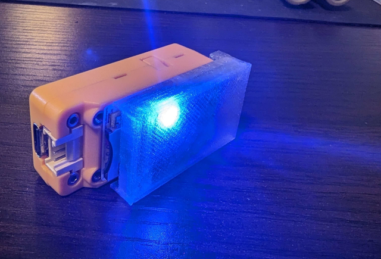

 

---

# Bin files at the moment need small fixes added. Please do not flash at this time. You may still compile the sketch for yourself though

## ⬆ Update Highlights 11/25/24 — Marauder v1.1.0 added ⬆
- Station selecting and attacks now fully working!
- Add commands for sniffing airtags
- Add ability to spoof airtags
- Add commands for listing and spoofing airtags
- Update NimBLE version from v1.2.0 to v1.3.5
- Add Flipper Zero Sniff
- Add commands for Flipper Zero Sniff
- Add icon for Flipper Zero Sniff
- Externalize some utils

 

<b>Want wifi-marauder on that tiny m5stickC plus or m5stickC plus2? Tried to build from source and hitting brick walls? Then this repo is what you're looking for! A simple way to install marauder on these cool tiny devices! 
  
These versions of marauder for m5stickC plus & m5stickC plus2 contains a few great fixes and v13.10 contains a clean bootscreen (Read more about the fixes below).  
I have also include the sketch folders with all edits already made if you'd prefer to build from source.</b>

  

## Shoutouts 📢
<b>A huge thank you goes to a few wonderful people. Whom without, I would have not made it as far as I did learning.</b>  
<b>Thanks to <a href=https://github.com/bmorcelli>Pirata/bmorcelli</a> for all your guidance on the m5stick compiling process and late night replies.</b>  
<b>And thank you to <a href=https://github.com/smoochiee>smoochiee</a> and <a href=https://github.com/Fr4nkFletcher>Fr4nkFletcher</a> for helping with Marauder Arduino IDE compiling.</b> 
And of course <a href=https://github.com/justcallmekoko>JustCallMeKoKo</a> for the foundational work on ESP32 Marauder. 

 

<b>Flasher & bin files are located at bottom of page</b>

<b>If you build from the files located in this repo make sure to select esp32/m5stick-c in board settings of ArduinoIDE.</b>

 

## SD Backpack

 
Build your own <a href=https://github.com/ATOMNFT/M5stick-CPlus-SD-Backpack>SD Backpack</a>.

 

## 🛠️ Fixes as of 04/07/24 🛠️
- BLE swift pairing windows attack fixed with no crashes and very fast attacks. (See video below)

## 🌟 Customaztions 🌟
- Custom bootscreen (v13.10 only) added to both the c plus and c plus2. 

## 🎞️ Video preview of swift pair spam in action 🎞️

 

## Installation Methods
1. Use the link below in google chrome to flash the project onto M5stickC plus or M5stickC plus2. 
  

&nbsp; &nbsp; **Flasher tool:** <a href=https://atomnft.github.io/M5stick-Marauder/flash0.html>M5stickC Plus/2 Tool</a>

2. Download <a href=https://docs.m5stack.com/en/download>M5Burner</a> and search for Marauder under (M5stickC) tab.

3. <b>You can download the bin files and flash them using m5burner or use with <a href=https://github.com/bmorcelli/M5Stick-Launcher>M5Launcher</a> by bmorcelli as well</b>

